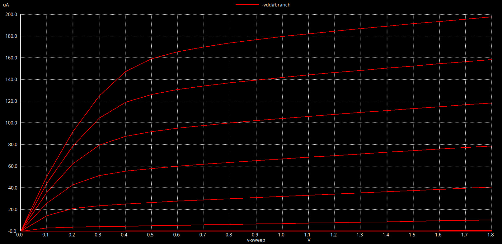
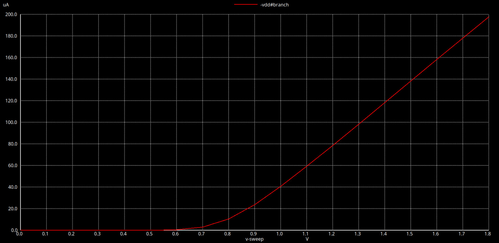
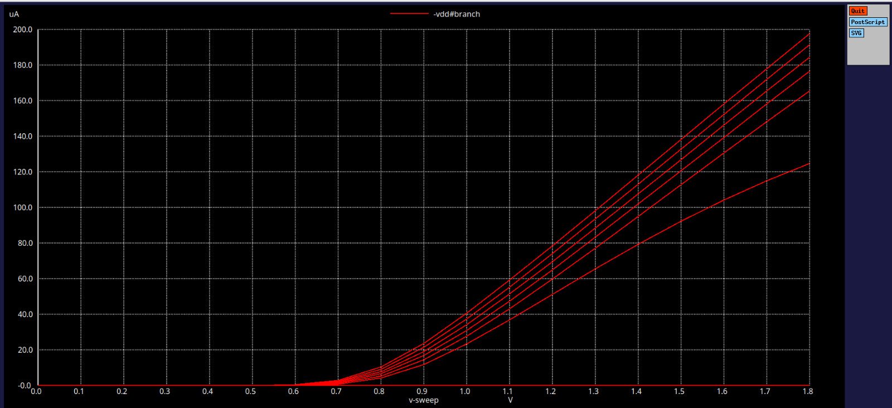

# Experiment 2: NMOS – Id–Vgs and Id–Vds Characteristics (Day 2)
## Objective

To simulate and analyze the drain current (Id) versus drain-to-source voltage (Vds) and gate-to-source voltage (Vgs) characteristics of an NMOS transistor using the Sky130 technology models.
To observe velocity saturation effects and understand device behavior in linear and saturation regions for long and short channel devices.
To extract the threshold voltage (Vth) and compare the Id–Vgs and Id–Vds trends.

## Model Description
```spice
.param temp=27

* Including sky130 library files
.lib "sky130_fd_pr/models/sky130.lib.spice" tt
```
## Netlist – Experiment 1: Id–Vds Characteristics
```spice
XM1 Vdd n1 0 0 sky130_fd_pr__nfet_01v8 w=0.39 l=0.15
R1 n1 in 55

Vdd vdd 0 1.8V
Vin in 0 1.8V

* Simulation commands
.op
.dc Vdd 0 1.8 0.1 Vin 0 1.8 0.2

.control
run
display
setplot dc1
.endc

.end
```

"From the above plot we infer that for lower values of Vgs the graph is showing a quadratinv behaviour, and for higher values of Vgs it shows a linear behaviour"
## Netlist – Experiment 2: Id–Vgs Characteristics
```spice
XM1 Vdd n1 0 0 sky130_fd_pr__nfet_01v8 w=0.39 l=0.15
R1 n1 in 55

Vdd vdd 0 1.8V
Vin in 0 1.8V

* Simulation commands
.op
.dc Vin 0 1.8 0.1

.control
run
display
setplot dc1
.endc

.end
```

The Id vs Vgs graph shows a linear behaviour aas expected in short channel.
## Simulation Setup
Tool: Ngspice

Technology: SkyWater 130nm PDK

Device: NMOS (sky130_fd_pr__nfet_01v8)

Device Dimensions: W = 0.39 µm, L = 0.15 µm

Voltage Sweep:
Vdd sweep: 0 → 1.8 V
Vin sweep: 0 → 1.8 V

## Results
| Vgs (V) | Id Behavior vs Vds                            | Region of Operation |
| ------- | --------------------------------------------- | ------------------- |
| 0.6     | Linear increase of Id with Vds; no saturation | Cut off region     |
| 0.8     | Id starts saturating around Vds ≈ 0.4 V       | Transition region   |
| 1.0     | Clear saturation beyond Vds ≈ 0.55 V          | Saturation region   |
| 1.2     | Higher Id; saturation more prominent          | Saturation region   |
| 1.4     | Deep saturation; Id maximum                   | Saturation region   |

## Id–Vgs Characteristics 
| Vds (V) | Id Behavior vs Vgs                        | Observation                           |
| ------- | ----------------------------------------- | ------------------------------------- |
| 0.1     | Id increases gradually with Vgs           | Linear region; device just turning on |
| 0.5     | Id rises faster with Vgs                  | Transitioning to saturation           |
| 1.0     | Id rises sharply beyond threshold voltage | Saturation region observed            |
| 1.8     | Id reaches maximum; strong inversion      | Fully ON NMOS                         |



## Observations

- Id–Vds curves demonstrate linear (ohmic) and saturation regions, consistent with MOSFET theory.

- Id–Vgs curves show the threshold voltage (Vth), marking the gate voltage where the device begins conducting.
 
- Velocity saturation effects are visible for short-channel devices: Id saturates earlier than expected from long-channel models.

- Increasing Vgs increases Id and shifts the saturation onset, illustrating the strong inversion regime.

## Discussion

The NMOS operates in resistive region at low Vds and saturates at higher Vds.Id–Vgs characteristics help extract Vth and understand body effect or substrate bias effects if Vsb ≠ 0.These simulations form the basis for designing CMOS inverters and understanding timing, delay, and noise margins in circuits.

## Conclusion

Both Id–Vds and Id–Vgs simulations successfully demonstrate NMOS behavior in Sky130 technology.Observations align with theoretical expectations: linear region, saturation region, and strong inversion.Understanding these characteristics is critical for CMOS circuit design and for predicting performance variations due to device dimensions and biasing.
