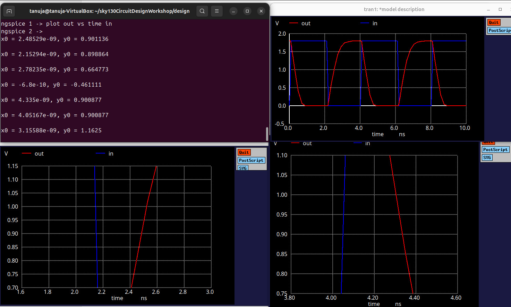
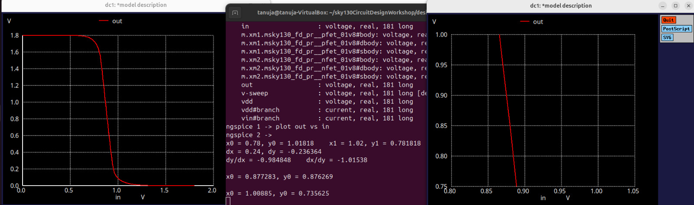

# Experiment 3: CMOS Inverter – Switching Threshold and Dynamic Simulations (Day 3)
## Objective
To simulate a CMOS inverter using Sky130 technology and analyze its static and dynamic behavior.
To determine the switching threshold voltage (Vm) from the Voltage Transfer Characteristic (VTC).
To study transient response (rise/fall delays) of the inverter under a pulse input.
To understand the effect of PMOS and NMOS sizing and load capacitance on inverter performance.

## Model Description
```spice
.param temp=27

* Including sky130 library files
.lib "sky130_fd_pr/models/sky130.lib.spice" tt
```
## Netlist – Experiment 1: Transient Simulation
```spice
XM1 out in vdd vdd sky130_fd_pr__pfet_01v8 w=0.84 l=0.15
XM2 out in 0 0 sky130_fd_pr__nfet_01v8 w=0.36 l=0.15

Cload out 0 50fF

Vdd vdd 0 1.8V
Vin in 0 PULSE(0V 1.8V 0 0.1ns 0.1ns 2ns 4ns)

* Simulation commands
.tran 1n 10n

.control
run
.endc

.end
```

From this graph , Rise delay is observed as 0.335ns and Fall delay is observed as 0.285ns
## Netlist – Experiment 2: DC Sweep for VTC
```spice
XM1 out in vdd vdd sky130_fd_pr__pfet_01v8 w=0.84 l=0.15
XM2 out in 0 0 sky130_fd_pr__nfet_01v8 w=0.36 l=0.15

Cload out 0 50fF

Vdd vdd 0 1.8V
Vin in 0 1.8V

* Simulation commands
.op
.dc Vin 0 1.8 0.01

.control
run
setplot dc1
display
.endc

.end
```

From this VTC curve we infer that that the switching threshold ( threshold at which the Vin is equal in Vout) is approximately 0.876 mV 
## Simulation Setup

Tool: Ngspice

Technology: SkyWater 130nm PDK

Devices:
PMOS (sky130_fd_pr__pfet_01v8), W=0.84 µm, L=0.15 µm
NMOS (sky130_fd_pr__nfet_01v8), W=0.36 µm, L=0.15 µm

Supply Voltage: Vdd = 1.8 V

Load Capacitance: 50 fF

Input Pulse: 0 → 1.8 V, rise/fall time = 0.1 ns, pulse width = 2 ns

## Results
Voltage Transfer Characteristic (VTC) – DC Sweep
| Parameter                  | Value / Observation       |
| -------------------------- | ------------------------- |
| Switching Threshold (V_m)  | ≈ 0.876 V (Vin = Vout)      |
| High-Level Output (V_{OH}) | ≈ 1.8 V                   |
| Low-Level Output (V_{OL})  | ≈ 0 V                     |
| Noise Margin High (NM_H)   | (V_{OH} - V_{IH}) ≈ 0.876 V |
| Noise Margin Low (NM_L)    | (V_{IL} - V_{OL}) ≈ 0.924 V |

Transient Response
| Parameter                   | Value / Observation                                  |
| --------------------------- | ---------------------------------------------------- |
| Rise delay (t_r)             | ≈ 0.335 ns                                             |
| Fall delay (t_f)             | ≈ 0.285 ns                                            |
| Effect of Load              | Capacitive load increases rise/fall times and delays |


## Observations

The VTC shows a clear inverter characteristic: output switches near Vm≈VDD/2.PMOS width is larger than NMOS to balance drive strengths; this ensures symmetric switching.Transient simulations show typical rise/fall delays, illustrating the effect of capacitive loading.The inverter transitions from logic high to low and low to high as expected, confirming proper CMOS behavior.

## Discussion

The switching threshold voltage (Vm) depends on the ratio of W/L for PMOS and NMOS.Delay times in transient simulation are affected by capacitance, transistor sizing, and supply voltage.Understanding both DC and transient behavior is critical for timing analysis and STA in digital circuits.

## Conclusion

CMOS inverter exhibits expected switching behavior in both DC and transient simulations.Switching threshold occurs near VDD/2, indicating well-matched PMOS and NMOS strengths.Transient results confirm rise/fall times and propagation delays consistent with Sky130 device models.These simulations provide insight into timing margins, delay, and robustness, which are critical for real CMOS circuit design.
