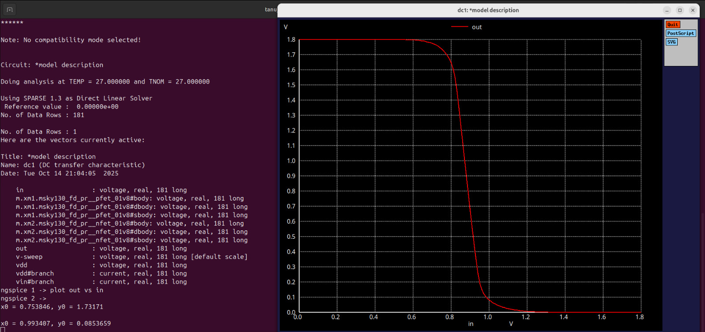

# Experiment 4: CMOS Inverter – Noise Margin Evaluation (Day 4)
## Objective
To simulate a CMOS inverter using Sky130 technology and analyze its static behavior.
To determine the Voltage Transfer Characteristic (VTC).
To extract noise margin parameters NML,NMH and understand inverter robustness.
To observe the effect of PMOS width on noise margins.

## Model Description
```spice
.param temp=27

* Including Sky130 library files
.lib "sky130_fd_pr/models/sky130.lib.spice" tt
```
## Netlist – DC Sweep for VTC
```spice   
XM1 out in vdd vdd sky130_fd_pr__pfet_01v8 w=1 l=0.15
XM2 out in 0 0 sky130_fd_pr__nfet_01v8 w=0.36 l=0.15

Cload out 0 50fF

Vdd vdd 0 1.8V
Vin in 0 1.8V

* Simulation commands
.op
.dc Vin 0 1.8 0.01

.control
run
setplot dc1
display
.endc

.end
```

From the above plot, we observe that NMH = 0.738V and NML = 0.668V
## Simulation Setup
Tool: Ngspice

Technology: SkyWater 130nm PDK

Devices:

PMOS (sky130_fd_pr__pfet_01v8), W = 1 µm, L = 0.15 µm

NMOS (sky130_fd_pr__nfet_01v8), W = 0.36 µm, L = 0.15 µm

Supply Voltage: Vdd = 1.8 V

Load Capacitance: 50 fF

DC Sweep: Vin from 0 → 1.8 V, step = 0.01 V

## Results
Voltage Transfer Characteristic (VTC)
| Parameter                   | Value / Observation        |
| --------------------------- | -------------------------- |
| Switching Threshold (V_m)   | ≈ 0.85 V                   |
| High-Level Output Voh  | ≈ 1.73 V                    |
| Low-Level Output Vol   | ≈ 0.085 V                      |
| Input Low Voltage Vil  | ≈ 0.75 V                   |
| Input High Voltage Vih | ≈ 0.993 V                   |
| Noise Margin Low NML     | (Vil - Vol) ≈ 0.668 V |
| Noise Margin High NMH   | (Voh - Vih) ≈ 0.738 V |

Increasing PMOS width (from previous labs) improves the drive strength of PMOS, slightly increasing the low-to-high switching threshold and modifying noise margins.

## Observations
The CMOS inverter exhibits expected VTC behavior with a clear switching point.Noise margins NML and NMH are symmetric but slightly shifted due to PMOS sizing.Proper sizing of PMOS and NMOS ensures robust operation under process and supply variations.The results illustrate the importance of device sizing for inverter noise immunity.

## Discussion
VIL and VIH define the valid input voltage ranges for logic low and high.Noise margins indicate how tolerant the inverter is to input voltage noise while maintaining correct logic output.PMOS/NMOS width ratio directly affects Vm, NML, and NMH.This experiment demonstrates static robustness evaluation, which is critical for digital circuit design and STA.

## Conclusion

DC sweep simulations provide the Voltage Transfer Characteristic of the CMOS inverter.Noise margins NML and NMH were successfully extracted and analyzed.Increasing PMOS width improves PMOS drive and affects the switching threshold and noise margins.These results are essential for robust CMOS logic design and for predicting logic reliability in real circuits.
