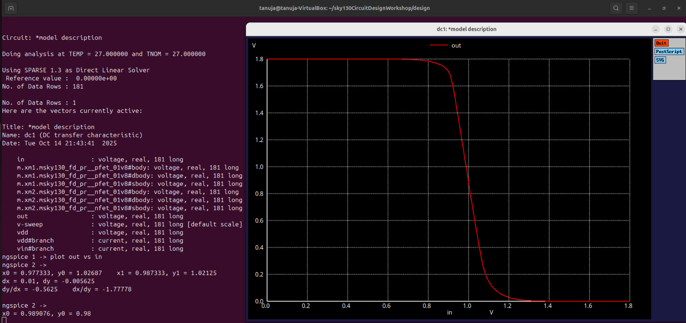
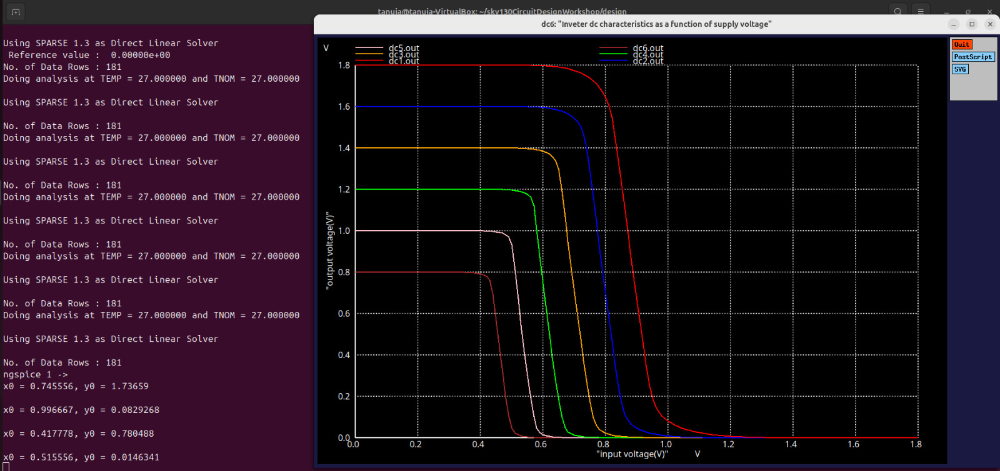

# Experiment 5: CMOS Inverter – Power Supply and Device Variation Robustness Evaluation (Day 5)
## Objective
To simulate a CMOS inverter using Sky130 technology under different supply voltages and device sizing variations.
To study the effect of Vdd variation on Voltage Transfer Characteristic (VTC) and switching threshold (Vm).
To understand how PMOS and NMOS sizing impacts inverter robustness and noise margins.

## Model Description
```spice
.param temp=27

* Including Sky130 library files
.lib "sky130_fd_pr/models/sky130.lib.spice" tt
```

## Netlist – Experiment 1: Device Variation (PMOS/NMOS Width Variation)
```spice
XM1 out in vdd vdd sky130_fd_pr__pfet_01v8 w=7 l=0.15
XM2 out in 0 0 sky130_fd_pr__nfet_01v8 w=0.42 l=0.15

Cload out 0 50fF

Vdd vdd 0 1.8V
Vin in 0 1.8V

* Simulation commands
.op
.dc Vin 0 1.8 0.01

.control
run
setplot dc1
display
.endc

.end
```

As we see in the plot the switch threshold shifted towards right due to variation in device parameters, the switching threshold value for this case is 0.98V
## Netlist – Experiment 2: Power Supply Variation
```spice
XM1 out in vdd vdd sky130_fd_pr__pfet_01v8 w=1 l=0.15
XM2 out in 0 0 sky130_fd_pr__nfet_01v8 w=0.36 l=0.15

Cload out 0 50fF

Vdd vdd 0 1.8V
Vin in 0 1.8V

.control
let powersupply = 1.8
alter Vdd = powersupply
let voltagesupplyvariation = 0
dowhile voltagesupplyvariation < 6
  dc Vin 0 1.8 0.01
  let powersupply = powersupply - 0.2
  alter Vdd = powersupply
  let voltagesupplyvariation = voltagesupplyvariation + 1
end

plot dc1.out vs in dc2.out vs in dc3.out vs in dc4.out vs in dc5.out vs in dc6.out vs in xlabel "Input Voltage (V)" ylabel "Output Voltage (V)" title "Inverter DC Characteristics as a Function of Supply Voltage"

.endc

.end
```

From the above output, we observe that the gain for the VTC of 1.8V is 7 and for VTCof 0.8V is 7.8 approximately.
## Simulation Setup
Tool: Ngspice
Technology: SkyWater 130nm PDK
Devices:
PMOS (sky130_fd_pr__pfet_01v8)
NMOS (sky130_fd_pr__nfet_01v8)
Supply Voltage (Vdd): 1.8 V, varied down in steps of 0.2 V
Load Capacitance: 50 fF
DC Sweep: Vin 0 → 1.8 V, step = 0.01 V

## Results
Device Variation (PMOS/NMOS Width Change)
| Parameter                 | Value / Observation                                    |
| ------------------------- | ------------------------------------------------------ |
| PMOS Width                | 7 µm                                                   |
| NMOS Width                | 0.42 µm                                                |
| Switching Threshold (V_m) | Increased slightly due to stronger PMOS                |
| VTC Shape                 | Steeper transition observed due to stronger PMOS drive |

Power Supply Variation
| Vdd (V) | Switching Threshold (V_m) (V) | Notes                               |
| ------- | ----------------------------- | ----------------------------------- |
| 1.8     | ≈ 0.9                         | Nominal operation                   |
| 1.6     | ≈ 0.85                        | Slight decrease in Vm               |
| 1.4     | ≈ 0.8                         | Reduced noise margin                |
| 1.2     | ≈ 0.75                        | Noticeable VTC shift                |
| 1.0     | ≈ 0.7                         | Logic swing reduced                 |
| 0.8     | ≈ 0.65                        | Device approaching threshold limits |

Observation: Lowering supply voltage shifts the inverter switching threshold left and reduces noise margins, illustrating decreased robustness at low Vdd.

## Observations

Increasing PMOS width strengthens the pull-up network, increasing Vm and steepening the VTC.Decreasing Vdd reduces the noise margins NML and NMH, making the inverter more sensitive to input noise.CMOS inverter robustness depends on device sizing and supply voltage, highlighting design trade-offs for low-power circuits.

## Discussion

Device variation and supply voltage variation are critical factors in STA.Robust design requires careful PMOS/NMOS sizing to maintain symmetric switching and adequate noise margins.Understanding the impact of Vdd scaling is essential for low-power design and reliable digital circuit operation.

## Conclusion

CMOS inverter performance changes significantly under device and supply variations.Stronger PMOS improves switching threshold and VTC slope.Reduced supply voltage lowers noise margins and shifts Vm.These results illustrate the importance of considering device variation and supply voltage tolerance in CMOS digital design.
